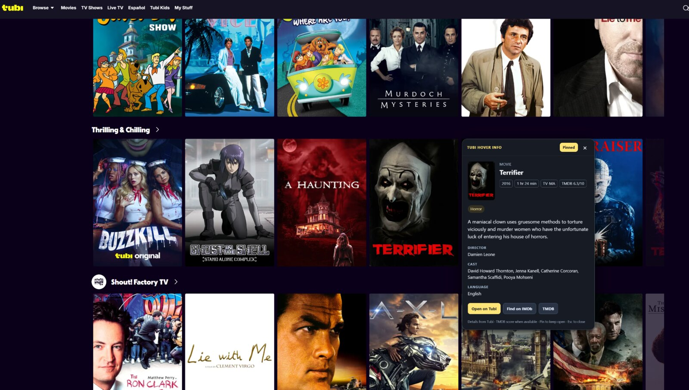

# Tubi Hover Info — v1.1.0

A browser extension for Tubi. Hover over a movie, show, or episode card to read its details in a dark panel.

[Download the packaged extension](https://github.com/RodgerE1/Tubi_Hover_Info/raw/refs/heads/main/downloads/Tubi_Hover_Info_v1.1.0.zip)

The download includes ready-to-load Opera / Opera GX and Firefox folders. Opera is the tested and recommended version; Firefox is an unsigned temporary add-on. See [release verification](TEST_RESULTS.md).

## Screenshot

## Install in Opera or Opera GX (recommended)

1. Extract **Tubi_Hover_Info_v1.zip** to a folder you will keep, such as your Desktop.
2. Open **opera://extensions** in Opera.
3. Turn on **Developer mode**.
4. Click **Load unpacked** (some versions call it **Load unpacked extension**).
5. Select **Tubi_Hover_Info\packages\Opera**. Select the folder that contains `manifest.json`.
6. Refresh any open Tubi tabs, then hover over a movie or show card.

Keep the extracted folder in place. Opera reads the extension from it. The Opera package also uses the standard Chromium extension format.

## Install in Firefox 128 or newer for testing

1. Extract the ZIP.
2. Open **about:debugging#/runtime/this-firefox** in Firefox.
3. Click **Load Temporary Add-on**.
4. Select **Tubi_Hover_Info\packages\Firefox\manifest.json**.
5. Refresh Tubi and hover over a card.

This Firefox package is unsigned and temporary: Firefox removes it when Firefox restarts. Normal permanent Firefox installation requires Mozilla signing. The package has not been submitted or signed.

## Use

- Hover for about **0.45 seconds** to open details beside the card.
- Move your pointer into the panel to read it or use its buttons.
- Select **Pin** to keep the panel open while browsing other cards. Select it again to unpin.
- Select **×** or press **Esc** to close.
- Select **Show all cast members** to expand longer cast lists.
- **Open on Tubi** opens that title in your current tab. **IMDb** opens Tubi's linked IMDb title in a new tab; **Find on IMDb** is used when Tubi provides no exact IMDb link.
- Optional **TMDB API key** support adds a `TMDB 0.0/10` score and a link to the matching TMDB title. Enter the key through the toolbar popup; it is stored only in this browser.
- Open the extension's toolbar icon to change the **hover delay**, **text size**, **poster artwork**, or turn hover details off.
- Keyboard focus on a title link also opens its details.

## Details shown

Title, synopsis, year as listed by Tubi, runtime, age rating, genres, cast, director, language, subtitles, the number of seasons listed on Tubi, and an optional TMDB community score, when available. It first uses the selected card's loaded movie information, then public detail pages when needed. Season counts and years reflect Tubi's local catalog listing, which can differ from a show's original debut or total production history. No outside review scores are invented.

Missing fields are omitted. If Tubi cannot provide details, the card information stays visible with an explanation, **Retry**, and a link to its title page. The extension supports Tubi's current `/movies/`, `/series/`, and `/tv-shows/` cards, including localized paths and cards added while scrolling or searching.

## Privacy and permissions

The extension requests access to `tubitv.com`, `tubi.tv`, `api.themoviedb.org` when TMDB is configured, and local extension settings storage. It reads Tubi title information and adds the hover panel. Public detail-page requests do not include your account cookies. The optional TMDB key is stored in browser-local extension storage and is sent only to TMDB; do not commit it to GitHub or share it publicly. No account password, paid service, telemetry, tracking server, remote JavaScript, video downloading, or browsing-history permission is used. Temporary title caches stay in browser memory; only your preferences and optional TMDB key are stored persistently. Images are loaded from Tubi. IMDb is contacted only when you choose its link.

This product uses the TMDB API but is not endorsed or certified by TMDB.

This is an independent personal extension and is not affiliated with Tubi. Tubi page changes may require an update.

## Update or remove

For Opera: replace the package files in the same folder, select **Reload** on the extension's entry, and refresh Tubi. To remove, use **Remove** on `opera://extensions`.

For Firefox: reload the temporary add-on in `about:debugging`, then refresh Tubi.

## Complete source and checks

`source/` contains the full readable JavaScript, CSS, HTML, and icons. `build.py` creates both browser manifests and packages using Python 3's standard library. Both `packages/` directories are complete copies ready to load. No npm installation or build step is needed to use the extension.

To rebuild both packages and the downloadable ZIP, run `python build.py`. The ZIP is written to `downloads/Tubi_Hover_Info_v1.1.0.zip`.

Run the helper tests with `node --test tests/core.test.cjs`. The browser checks are in `tests/browser.test.cjs`; they connect only to a separately launched, local debugging browser when its port is supplied. See `TEST_RESULTS.md` for the checks actually completed on this release.

Official installation references:
- https://help.opera.com/en/extensions/testing/
- https://extensionworkshop.com/documentation/develop/temporary-installation-in-firefox/
